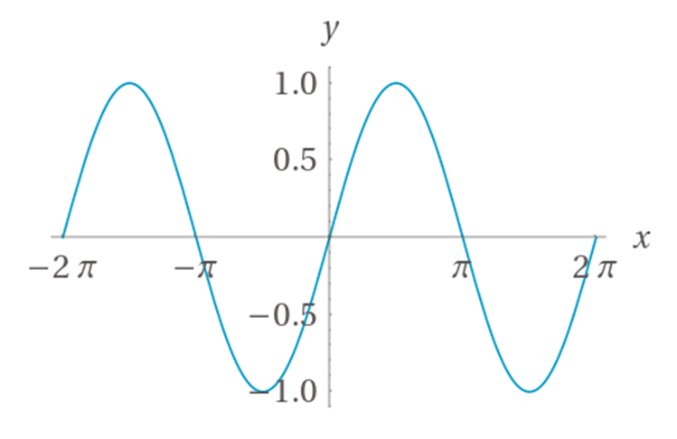
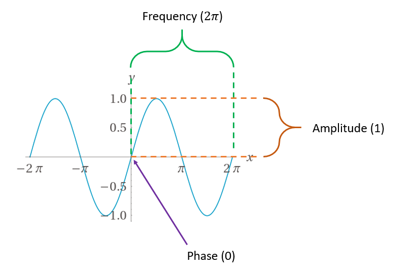
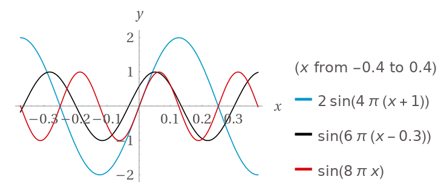
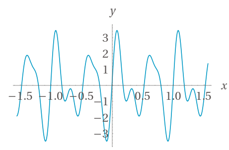
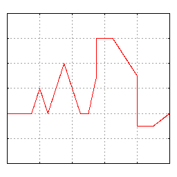
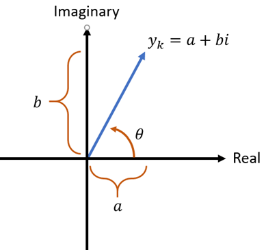
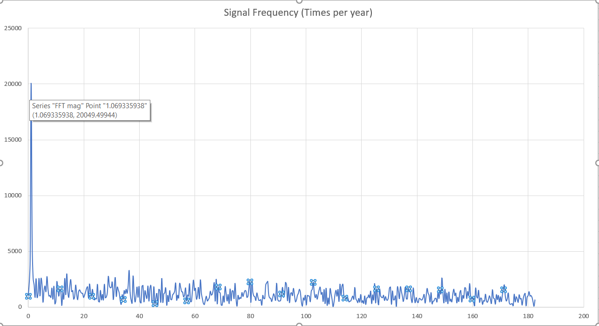
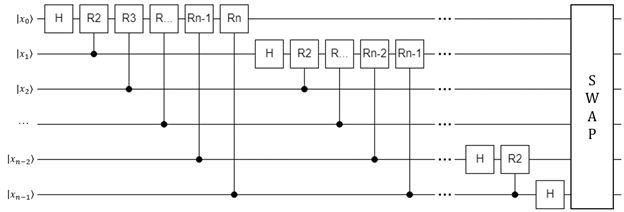

# Quantum Fourier Transform

## Waves

Let's take a break from quantum mechanics for a moment, and let's talk about **data**.
Data can take many forms, but one of the most common is a regular measurement of **some value over time**.
This could be the output of a sensor during an experiment, a long term study of a city's population, or the temperature of your room.

Whatever the case, when you collect data in this way, you typically do it because you want to look for anomalies, trends, or patterns.
One natural way to do this is to visualize the data by plotting it on a chart, where the X-axis is time and the Y-axis is the value of your measurement.
In some cases, this makes it much easier to spot patterns than just going through the raw numbers.
For example, here is a graph of my solar panel production for the last four years:

{: .center .xlarge loading=lazy }

Do you notice any obvious trends in this graph?

The thing that stands out the most to us is the repeating nature.
You can clearly see a rise in output during the summer, followed by a dip in output during the winter (as you'd expect to see based on the shorter days in the winter and snow cover).
This is an example of **periodic behavior**, where some pattern repeats at a regular interval.
The year-long cycle is easy to spot, but what about others?
Are there other periodic behaviors in this graph that are too subtle, or too fast, to easily see?

To answer that, we need to talk about **waves**.

There are lots of different types of waves in the world - water waves defined by the motion of water, sound waves defined by the way air molecules vibrate, light waves defined by oscillations in the electromagnetic field... but for this topic, let's use this definition: **a wave is a regular, repeating pattern in data**.

Here's a picture of a wave in its purest form - the **sine wave**, which is provided by the equation $y=\sin(x)$:

{: .center .medium loading=lazy }

As with before, the X-axis represents time and the Y-axis represents the value of the function.
Here is an annotated version of the graph that defines several key terms we're going to use when discussing waves:

{: .center .xlarge loading=lazy }

- The **frequency** refers to how long it takes for the pattern in the wave to repeat.
- The **amplitude** refers to how large of a signal the wave produces.
- The **phase** refers to the "starting point" of the pattern with respect to time. For sine waves, it can range from 0 to $2\pi$ radians (0 to 360°).

So for this simple sine wave, we can say that it has a frequency of $2\pi$, an amplitude of 1, and a phase of 0.

Here's another sine wave, given by the equation $y=3 \sin \left( 2x + \frac{\pi}{2} \right)$:

{: .center .xlarge loading=lazy }

Can you find the frequency, amplitude and phase?

Here is the annotated version:

{: .center .xlarge loading=lazy }

Here the frequency is $\pi$, the amplitude is 3, and the phase is $-\pi/4$.

In general, the formula for a wave looks like this:

$$
y = a \cdot \sin(f \cdot x + p)
$$

The coefficient $a$ controls the amplitude, $f$ controls the frequency, and $p$ controls the phase.
If you have the equation, determining thsoe three components is trivial.
For simple waves like this, it's also easy by just looking at the graph.
But our solar panel output graph doesn't look nearly this smooth and uniform.
It's got lots of ups and downs and fluctuations.
If we want to look for different patterns in it, we need to treat it like a **compound wave**.

## Compound Waves

In the above example, you can see how modifying the input to the sine function or multiplying the output by a coefficient can change the amplitude, frequency, and phase.
However, at the end of the day it still looks like a sine wave - it's just squished or stretched or moved around.
Now, consider this graph where there are three different sine waves:

{: .center .xlarge loading=lazy }

Each one of these has its own amplitude, phase, and frequency.
What do you think will happen if we add them together?

We already discussed this in the quantum interference sections: when adding two waves, if both components have the same sign, the overall sum will be larger than the individual parts - **constructive** interference.
If the components have different signs, the waves will negate each other and the sum will be reduced - **destructive** interfere.
This is what the sum of the above waves will produce (with an extended X axis for clarity):

{: .center .xlarge loading=lazy }

This combination of constructive and destructive interference of the three original waves has produced a new wave.
The new wave doesn't really look like any of its original inputs.
However, this isn't necessarily a bad thing - we can actually take advantage of this in a very interesting way.
If we very carefully craft a set of sine waves to add, so that they constructively and destructively interfere in *just* the right way, we can actually create an approximation of literally any function!

For example, here is a rather complex function that is approximated purely by adding more and more sine waves - as you can see, the more you add, the closer the approximation becomes:

{: .center .xlarge loading=lazy }

*Image taken from Wikipedia: [https://en.wikipedia.org/wiki/Fourier_series#/media/File:Example_of_Fourier_Convergence.gif](https://en.wikipedia.org/wiki/Fourier_series#/media/File:Example_of_Fourier_Convergence.gif)*
{: .center }

This technique is called creating a **Fourier series** for the original data.
A Fourier series is simply a function composed of carefully-crafted sine waves that gives you an approximate function; this lets you analyze the individual components, and hopefully discern some interesting things about them.
This is right up our alley for our original solar panel output question - we can see the obvious 1-year component, but are there any others?

To answer that, we need a way to approximate the original data using sine waves.
The name of the technique used to do this is the **Fourier Transform**.

## The Discrete Fourier Transform

Simply put, the Fourier Transform is the name of an operation that transforms data from amplitude-over-time into a collection of complex numbers that capture amplitude-over-frequency and phase-over-frequency.
Each frequency in the output can be thought of as a single sine wave that you can add to the Fourier series in order to produce the original data.
Since it captures the amplitude, frequency, and phase, we have everything we need to produce the corresponding sine waves.
This specific operation is called the **Discrete Fourier Transform (DFT)** since each original data point represents a value at a discrete time step.

As a function, the DFT is formally described as this operation:

$$
X_k = \sum_{n=0}^{N-1} x_n \cdot e^{-2\pi kni / N}
$$

Where $N$ is the number of values in your original data, $x_n$ is the $n$-th value of your original data, and $k$ is the index of the corresponding output value.
So to calculate the entire thing for your whole input set, you'd run this complete operation using $k=0$ to get the first value (which is always 0), then $k=1$ for the next value, all the way up to $k=N-1$ to get the last value.

Accordingly, the $X_k$ frequencies of the output aren't exact frequencies - they're simply **bins** or **ranges** that the corresponding sine waves fall into.
*(Or, more accurately, cosine waves since that's what the Fourier series gives us.)*
The fidelity of the DFT is largely dependent on the number of samples you have in the original data - the more samples, the easier it is for it to find patterns and the higher-quality the resulting Fourier series will be.
In other words: the more samples you give it, the smaller the bin size, and thus the higher the resolution of the resulting Fourier series.

!!! note
    The exact description of why this works, and what this math is actually doing, is far beyond the scope of this class.
    We encourage you to read up on the theory behind the Fourier transform if you're interested in the underlying mechanics.*

## Approximating a Function with the Fourier Transform

Let's do an example of the DFT to show how it works.
We'll start by taking evenly-spaced samples of the original composite function above.
Let's say we want 128 samples (because powers of two are much more convenient to work with in DFT implementations), and we want them to range from -2 to 2.
That's a range of 4, so we want to calculate the value in intervals of $4/128=0.03125$.

We have **128** samples, which we'll call $N$.
Our sampling frequency is $128/4$, which is **32 Hz** - we'll call this $f$.
Our sample range is **4** - we'll call this $r$.
The actual samples look like this:

| Sample (i) | $x$ | $y$ |
| - | - | - |
| 0 | -2 | 0.587785252 |
| 1 | -1.96875 | 2.410664982 |
| 2 | -1.9375 | 3.386583483 |
| 3 | -1.90625 | 3.233666592 |
| 4 | -1.875 | 2.156434465 |
| 5 | -1.84375 | 0.721992546 |
| 6 | -1.8125 | -0.438426602 |

Typically, this is what your actual data will look like - data over time.

After it's plugged into the DFT, this is the output (truncated to the interesting parts):

| Sample ($i$) | $DFT(x_i)$ |
| - | - |
| 0-7 | 0 |
| 8 | -128i |
| 9-11 | 0 |
| 12 | 37.6182561467182 - 51.7770876399967i |
| 13-15 | 0 |
| 16 | -64i |
| 17-111 | 0 |
| 112 | 64i |
| 113-115 | 0 |
| 116 | 37.6182561467182 + 51.7770876399967i |
| 117-119 | 0 |
| 120 | 128i |
| 121-127 | 0 |

Here's what the imaginary portions of these look like when they're plotted out:

{: .center .xlarge loading=lazy }

A few things to note right off the bat:

1. There are two groups of "spikes", each with the same number of outputs as inputs.
1. The output of DFT is a complex number.

Before we do anything else, the first step to interpreting the results is to **discard the entire second half of the output**.
This is because the DFT doesn't work on frequencies higher than half the original sample rate - this is known as the [Nyquist frequency](https://en.wikipedia.org/wiki/Nyquist_frequency).
This just means we can throw away samples 64 and above, so we're left with the three spikes at samples 8, 12, and 16.

Once we do that, let's take a look at a general version of one of the output values on the complex plane:

{: .center .xlarge loading=lazy }

While it's not immediately obvious, this actually contains all of the information we need to extract the amplitude, frequency, and phase of one of the waves that make up the provided data.

### The Frequency

Each DFT value corresponds to a sine wave with a specific frequency.
Or, more accurately, it corresponds to a range of frequencies between its start and end, and all of them are aggregated up into a single value.
The frequency represented by a DFT value is given by:

$$
f_i = \frac{i}{r}
$$

Where $r$ is the value range (largest value minus smallest value).
In our example the range is $2 - (-2)$, which is 4.

### The Amplitude

The amplitude is directly extracted from the **magnitude** of this complex number:

$$
a_i = \frac{2 \lvert y_i \rvert}{N} = \frac{2 \sqrt{\Re(y_i)^2 + \Im(y_i)^2}}{N} = \frac{2 \sqrt{a^2+ b^2}}{N}
$$

where $y_i$ is the DFT of the $i$-th sample, $\Re(x)$ is the real part of the complex number $x$, and $\Im(x)$ is the imaginary part of the complex number.

### The Phase

The phase is directly extracted from the **angle** of this complex number, relative to the X-axis:

$$
p_i = \theta = \text{atan2}(\Im(y_i),\Re(y_i)) = \text{atan2}(b,a)
$$

where $\text{atan2}$ is the `atan2` function that most math libraries provide.
It's simply the inverse tangent ( $\tan^{-1}$ ) that has some extra functionality to make it behave correctly across all of the inputs, which regular $\tan^{-1}$ doesn't do.
[Take a look here](https://en.wikipedia.org/wiki/Atan2) for more information on `atan2` if you're interested.

Note that this will give you the angle in **radians**.

### Recreating the Waves from DFT

Before moving on, we should reiterate that DFT gives us the properties of **cosine** waves to add up in the Fourier series, not sine waves.
Cosine waves are the same as sine waves but shifted by a phase of $\frac{-\pi}{2}$.
You could also add up sine waves instead and just subtract $\frac{\pi}{2}$ from all of the phases that DFT provides - you end up getting the same thing.

The general form for each component provided by DFT is this:

$$
c_i = a_i \cos(2 \pi f_i x + p_i)
$$

Armed with this knowledge, we can now get back to our example.
Right off the bat, we can safely ignore any value where the DFT output is 0, because it will result in a wave with 0 amplitude.
This means that the sine wave at that frequency isn't a component in the original data.
If we discard those, that leaves us with three rows:

| Sample ($i$) | $DFT(x_i)$ |
| - | - |
| 8 | -128i |
| 12 | 37.6182561467182-51.7770876399967i |
| 16 | -64i |

These are going to be our waves.
Let's extract all of the details from them, starting with the first:

$$
\displaylines{
f_8 = \frac{i}{r} = \frac{8}{4} = 2
\\~\\
a_8 = \frac{2 \lvert y_8 \rvert}{N} = \frac{2 \sqrt{0^2 + (-128)^2}}{128} = 2
\\~\\
p_8 = \text{atan2}(\Im(y_8),\Re(y_8)) = \text{atan2}(-128,0) = \frac{-\pi}{2}
}
$$

Excellent!
We have a wave with a frequency of 2, an amplitude of 2, and a phase of $\frac{-\pi}{2}$.
That means our first term will be $2\cos(4 \pi x - \frac{\pi}{2})$.
If we process the other rows, we find that the second term will be $\cos(6 \pi x - \frac{3 \pi}{10})$, and the third term will be $\cos(8 \pi x - \frac{\pi}{2})$.
Thus, our recreated Fourier series is:

$$
f(x) = 2\cos \left( 4 \pi x - \frac{\pi}{2} \right) + \cos \left( 6 \pi x - \frac{3 \pi}{10} \right) + \cos \left( 8 \pi x - \frac{\pi}{2} \right)
$$

This is a little different from the original three equations that we added together to produce the compound sine wave, but let's see what this outputs:

{: .center .xlarge loading=lazy }

Success!
This is a perfect replica of our original function.
DFT has given us a way to determine the frequency, amplitude, and period of any repeating components in the input data.

So, with all of that context out of the way, here is a graph of the amplitudes-over-frequencies for the solar panel output from the beginning, constructed by running it through the DFT:

{: .center .xlarge loading=lazy }

There's the (obvious) big spike at 1 Hz (once per year), but there don't appear to be any other notable periodic patterns.
The rest is just noise.
Oh well!
Guess weather truly is unpredictable!
At least we learned how to answer this *burning* question.

What else can it be used for?
We'll get to that, but first let's talk about the quantum version of DFT.

## The Quantum Fourier Transform

As a reminder, the DFT expressed as an operation has this form:

$$
X_k = \sum_{a=0}^{N-1} x_a \cdot e^{-2\pi kai / N}
$$

Where $X$ is an array of $N-1$ items.

How would we express this in terms of a quantum operation?

The first thing we'd need to do is represent the values of $x_a$ themselves somehow.
We could try to put a register into superposition where the only terms that show up are the values of $x$, like this:

$$
\ket{x} = \ket{x_0} + \ket{x_1} + ... + \ket{x_{n-1}}
$$

But there are two immediate problems with this strategy.
First, it does weird things if there are two terms in the register that have the same value.
For example, if $x_0$ and $x_1$ had the same value, that information would be lost in this superposition.

Second, it doesn't preserve the relationship between $a$ and $x_a$.
In other words, the fact that $x_a$ is the $a$-th term is important, but it isn't represented by this superposition.

Both of those reasons mean that this representation won't work.
What we really need is something where both $a$ and $x_a$ are represented somehow and their relationship is preserved.

Typically, there are two ways to do this with quantum systems.
The first way is with two registers - one represents $a$, one represents $x$, and they are entangled in such a way that for every value of $a$ in the first register, the second register has the cooresponding value $x_a$.
Formally, it looks like this:

$$
\ket{a,x} = \ket{0, x_0} + \ket{1, x_1} + ... + \ket{N-1, x_{N-1}} = \sum_{a=0}^{N-1} \ket{a, x_a}
$$

The second way only uses one register, which stores $a$, and then $x_a$ is stored in the **amplitude** of each term in that register:

$$
\ket{x} = x_0 \ket{0} + x_1 \ket{1} + ... + x_{N-1} \ket{N-1} = \sum_{a=0}^{N-1} x_a \ket{a}
$$

Though, of course, the values will have to be **normalized** so that the sum of their squares equals one.
That is, they must all be divided so that their *absolute* values are lost, but their *relative* values are preserved.
Luckily, this information is still enough to recover the original values later on.

Both of these techniques have their own uses in various quantum algorithms, and we'll cover them more later.
For the quantum version of the Fourier Transform, called the **Quantum Fourier Transform (QFT)** we're going to use the **second representation**.

### The Inverse QFT

For historical reasons, the Quantum Fourier Transform is typically defined as the **inverse** of the regular Discrete Fourier Transform.
Whereas the DFT is this operation:

$$
X_k = \sum_{a=0}^{N-1} x_a \cdot e^{-2\pi kai / N}
$$

The QFT typically is represented as this operation:

$$
X_k = \sum_{a=0}^{N-1} x_a \cdot e^{2\pi kai / N}
$$

Note that it's the same thing, but the exponent of $e$ is positive instead of negative with the QFT.
In practice, it simply means that the QFT has the opposite effect of the DFT.
Thus, if you want to calculate the DFT of something with a quantum computer, you need to apply the **Inverse Quantum Fourier Transform (IQFT)**, which is the **adjoint** of the normal QFT.
Q# makes this trivial by using the `adjoint` keyword, so you can easily use either the QFT or the IQFT in code.

With that clarification out of the way, let's describe what the IQFT will actually do to a register.

First, for the sake of convenience, let's assume that the size of the original array is a power of two (that is, $N = 2^n$).
Using the above amplitude-based technique, the original values of $x$ are represented like this:

$$
\ket{x} = \sum_{a=0}^{2^n-1} x_a \ket{a}
$$

After the Inverse Quantum Fourier Transform, the register will be in this superposition:

$$
\ket{x^\prime} = \sum_{k=0}^{2^n-1} \sum_{a=0}^{2^n-1} x_a \cdot e^{-2\pi kai / 2^n} \ket{a}
$$

Thus, as expected, the Fourier Transformed values of $x$ will be stored in the amplitudes of $x^\prime$ after the IQFT.
You might recall from the Fundamentals sections earlier that if you multiply an amplitude by $e^{i\phi}$, you're just modifying its phase (the amount of imaginary-ness in the amplitude) without changing the actual magnitude of the $\ket{0}$ or $\ket{1}$ terms.
Indeed, the IQFT is implemented by using some very carefully-crafted applications of the $R_\phi$ gate to accomplish exactly this.

The complete derivation of how the IQFT works mathematically is quite long and somewhat complex.
We'll touch on a few of the concepts involved later when we get to Shor's algorithm, but for now it's outside the scope of this particular lecture.
Nevertheless, since you already know what it does, we're going to describe how to build it as a quantum algorithm.

### The Circuit

In its general form, this is the circuit diagram for the regular (non-inverted) QFT:

{: .center .xlarge loading=lazy }

!!!note
    As a reminder, this is the equivalent of the **inverse DFT** on a classical computer because the QFT uses the opposite convention of the DFT.
    To get the equivalent of the DFT, run the **adjoint** of this circuit (all of the gates in reverse order and negate the exponent in the `RX` gates, or just use Q#'s `adjoint` keyword).

This diagram introduces a bit of notation that may not be obvious at first glance; each of the `RX` blocks refer to a specific implementation of the $R_\phi$ gate:

$$
R_a = \begin{bmatrix} 1 && 0 \\ 0 && e^{2 \pi i / 2^a} \end{bmatrix}
$$

So, for example, `R3` means this gate:

$$
R_3 = \begin{bmatrix} 1 && 0 \\ 0 && e^{2 \pi i / 2^3} \end{bmatrix} = \begin{bmatrix} 1 && 0 \\ 0 && e^{\pi i / 4} \end{bmatrix}
$$

Here are the steps to follow in order to implement it:

1. Start with the first qubit in the register.
   Apply H to it.
1. Iterate through all of the subsequent qubits.
   For each one, apply a controlled phase gate with the later qubit as the control, and the current qubit as the target.
   For the argument $a$, use 1 + the difference between the qubit indices.
1. Once you have iterated through all of the qubits in step 2, move to the next qubit and repeat steps 1 and 2 for it.
1. At the end, reverse the order of the qubits in the register with the SWAP gate.

This rather esoteric circuit will actually do an in-place transform, calculating the QFT of the amplitudes for each state in the input register, and replacing those amplitudes with their (inverse) Fourier Transform values.

So why is this such a big deal?
What's special about the QFT compared to the classical DFT?

When calculating the classical DFT, you have to iterate through the entire array $x$ - since this is of size $2^n$, it means that the number of operations scales **exponentially** with the number of bits in the sample count.
This, for every bit you add to the sample count, it takes twice as many calculations.

On the other hand, as you can see from the circuit diagram, the QFT (and IQFT) have at most $n$ controlled $R_\phi$ gates for each qubit and there are only $n$ qubits.
Thus, it's complexity is $O(n^2)$ instead of $O(2^n)$.
This is an **exponential** speedup over the classical DFT!
This is because of the fact that we've managed to store $2^n$ classical bits in a superposition of $n$ qubits, and the QFT applies to all of them in a single iteration.
It is another example of **quantum parallelism**.

What this means is that in some cases where the classical DFT would take an impractically long time to calculation, the QFT can be calculated very quickly.
We'll see an example of what this can be used for in the next section.

## Interpreting the Inverse QFT

As you might expect, the inverse QFT tends to be used much more frequently than the regular QFT (because the inverse corresponds to the regular DFT).
The way it's typically used is as follows:

1. Prepare some register in a desired superposition.
1. Run the inverse QFT on that register.
1. Measure the entire register and interpret it as an integer, call it `output`.
    - This won't give you the amplitude or phase, it just gives you the **sample number** of one of the frequencies that had a non-zero amplitude.
1. Do some classical post-processing to retrieve the measured frequency from `output`.

Note that as will all things quantum, you can only measure once - this means that if the samples in the original superposition contain a wave with more than one frequency component, you can't use the QFT to retrieve all of them.
**You can only retrieve the frequency of one component per run**.

Once you've measured `output`, the classical post-processing is simple:

1. Check if `output` is greater than half of the number of samples ($2^n$, where $n$ is the number of qubits in the register)
    1. If it is, set `output = 2^n - output` to mirror the result around the halfway point of the samples; this will bypass the problem with the Nyquist frequency we described earlier.
1. Convert the raw `output` value to the actual `frequency` it represents with $frequency = output \cdot sample\, rate / 2^n$.

## Lab 8

With that, you have everything you need to tackle the Quantum Fourier Transform in Lab 8.
