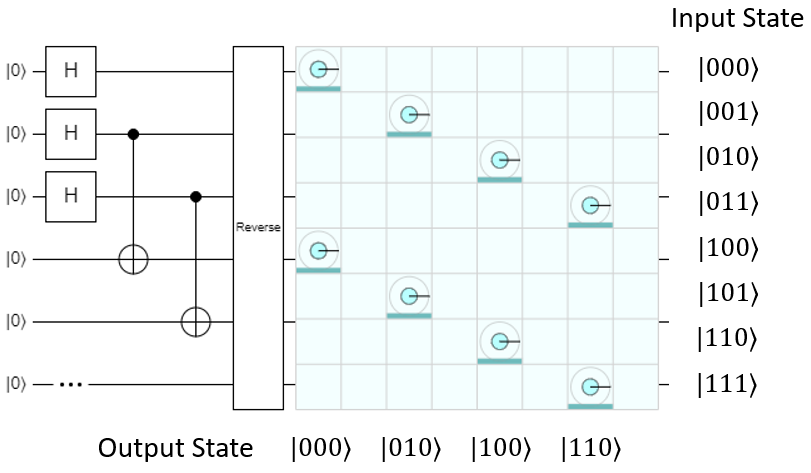
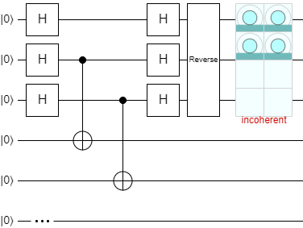
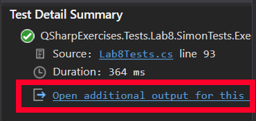
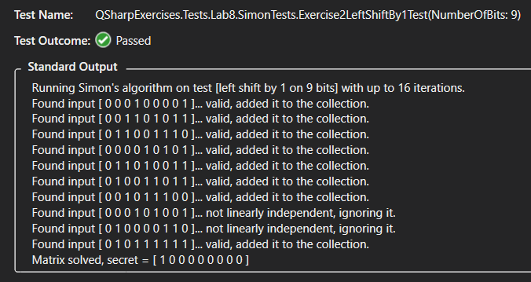

# Simon's Algorithm

## Another Black-Box Oracle Problem

Let's say we're given an unknown, black-box quantum operation. We know it has this signature:

```
operation BlackBox(Input : Qubit[], Output : Qubit[]) : Unit
```

It takes in two registers, an "input" and an "output".
We know that both registers are required to be the same size.
Also, we know that the operation will essentially perform some calculation on the input register and put the results of it into the output register.
For example, Let's say this operation takes in 3-qubit registers, and left-shifts the input by 1 bit.
Here would be a table of inputs and outputs for it:

| Input | Output |
| - | - |
| 000 | 000 |
| 001 | 010 |
| 010 | 100 |
| 011 | 110 |
| 100 | 000 |
| 101 | 010 |
| 110 | 100 |
| 111 | 110 |

We also know that this operation is a **2-to-1** function.
This means for every possible output, there are exactly 2 inputs that produce it.
In the left-shift example above, there are four output values: 000, 010, 100, and 110.
For each one, there are 2 inputs that provide it: for example, 010 and 110 both result in 100.

The last thing we know about this operation, and this is the key piece of information, is that it contains a "secret string" called $s$.
Every pair of inputs that produces the same output value, when XOR'd together, results in this secret string.
Mathematically speaking, if we have a pair of inputs $x_0$ and $x_1$ that result in output $y$, then:

$$
\displaylines{
f(x_0) = y, \qquad f(x_1) = y
\\~\\
x_0 \oplus x_1 = s
}
$$

To demonstrate: let's look at the pairs in the left-shift function.
The pairs are 000 and 100, 001 and 101, 010 and 110, and 011 and 111:

$$
\displaylines{
f(\ket{000}) = 000, \qquad f(\ket{100}) = 000, \qquad \ket{000} \oplus \ket{100} = \ket{100}
\\~\\
f(\ket{001}) = 010, \qquad f(\ket{101}) = 010, \qquad \ket{001} \oplus \ket{101} = \ket{100}
\\~\\
f(\ket{010}) = 100, \qquad f(\ket{110}) = 100, \qquad \ket{010} \oplus \ket{110} = \ket{100}
\\~\\
f(\ket{011}) = 110, \qquad f(\ket{111}) = 110, \qquad \ket{011} \oplus \ket{111} = \ket{100}
}
$$

So for the left-shift-by-1 operation on 3 qubits, the secret string is $s=100$. 

Here’s another example problem (figuring out how this works is actually a challenge problem in this lab):

| Input | Output |
| - | - |
| 000 | 101 |
| 001 | 010 |
| 010 | 000 |
| 011 | 110 |
| 100 | 000 |
| 101 | 110 |
| 110 | 101 |
| 111 | 010 |

The pairs in this one are 000 and 110, 001 and 111, 010 and 100, and 011 and 101.
Let's evaluate them below to find the secret string:

$$
\displaylines{
f(\ket{000}) = 101, \qquad f(\ket{110}) = 101, \qquad \ket{000} \oplus \ket{110} = \ket{110}
\\~\\
f(\ket{001}) = 010, \qquad f(\ket{111}) = 010, \qquad \ket{001} \oplus \ket{111} = \ket{110}
\\~\\
f(\ket{010}) = 000, \qquad f(\ket{100}) = 000, \qquad \ket{010} \oplus \ket{100} = \ket{110}
\\~\\
f(\ket{011}) = 110, \qquad f(\ket{101}) = 110, \qquad \ket{011} \oplus \ket{101} = \ket{110}
}
$$

So for this example, the secret string is $s=110$.

Now, it might have become obvious to you that we don't actually need to evaluate all of the pairs to figure out the secret string; we can get it just by finding any one pair of inputs that produce the same output, and XORing them together.
(Note: there's a special case where $s=000$ that results in the function being 1-to-1, but we'll get to that later.)
This brings us to the problem at hand:

Given one of these 2-to-1 functions with a secret string, how long will it take you to figure out what the secret string is?
In other words, how many iterations do you need to do in order to find a pair of inputs that produce the same output?

This is another one of those cases where if we're running the operation on a classical computer, it's all up to luck.
If we get lucky, we'll find a pair on our first two input checks.
If we get tremendously unlucky, we'll chew through half of the possible inputs without finding a pair, then the very next iteration (half plus one) is guaranteed to give us a pair.
Like the Deutsch-Jozsa algorithm, this means our worst-case time is $2^{n−1}+1$ tries, but there's a catch: that would require storing all of the input-output pairs we've tried in a dictionary or map of some kind.
If the input is 128 bits, we'd have to store $2^{127}$ pairs which is around $10^{40}$ bits total, a completely impractical number.
Realistically, we're going to have to pick a small subset of the outputs to keep track of and just look for pairs on them, so we're looking at around a $2^{128}$ order-of-magnitude estimate for a classical computer.
To be specific, for $n$ bits of input, it will take around $2^n$ tries to solve the problem.

Luckily for us, there is a quantum algorithm that can solve it in $n$ tries.


## Simon's Algorithm

The quantum algorithm that solves this problem is called **Simon's algorithm**, named after a computer scientist named Daniel Simon that figured it out in 1994.
From a quantum computing standpoint, Simon's algorithm is one of our personal favorites for four reasons:

1. It's actually a **hybrid** algorithm - it has both a quantum part and a classical post-processing part
1. It leverages all three key features of quantum computing: superposition, interference, and entanglement
1. It's not probabilistic like Grover's algorithm; it provides a correct answer 100% of the time
1. Unlike Deutsch-Jozsa, it's not just a toy problem; it has some practical applications in **quantum cryptography**

The classical post-processing is kind of hard to explain.
It took us 9 pages to write it up in a paper once.
The long-story-short version is that you can use the quantum step to give you a random bit string that is guaranteed to have a mod-2 dot product of zero when run against the secret string, and you can collect enough of these to solve a bunch of linearly independent equations with a very efficient classical algorithm called [Gaussian elimination](https://en.wikipedia.org/wiki/Gaussian_elimination).

In slightly more detail, Simon's algorithm works like this:

- Run the quantum oracle with the input register in a superposition of all possible inputs, then apply the H gate to all of the input qubits and measure them.
    This will "magically" give you a bit string $y$ where the mod-2 dot product of the bit string and the secret string $s$ is 0:

    $\qquad (y_0 \cdot s_0) \oplus (y_1 \cdot s_1) \oplus ... \oplus (y_{n-1} \cdot s_{n-1}) = 0$

    I'll go into how this works later.

- Add the bit string to a collection of outputs.
- Run the quantum step again.
    Check if the output is **linearly independent** with all of the outputs in the collection so far.
    If it is, keep it.
    If not, ignore it.
- Repeat this process until you have $n−1$ linearly independent bit strings.
    If you're a little unlucky, you may need to do it slightly more than $n$ times, but in our experience, this number of "extra" tries is usually in the single-digits and practically disappears for larger input sizes.
    At this point, you now have $n−1$ linearly independent bit strings of the following form:

    $\qquad (y_{0,0} \cdot s_0) \oplus (y_{0,1} \cdot s_1) \oplus ... \oplus (y_{0,n-1} \cdot s_{n-1}) = 0$  

    $\qquad (y_{1,0} \cdot s_0) \oplus (y_{1,1} \cdot s_1) \oplus ... \oplus (y_{1,n-1} \cdot s_{n-1}) = 0$  

    $\qquad ... \\$

    $\qquad (y_{n-2,0} \cdot s_0) \oplus (y_{n-2,1} \cdot s_1) \oplus ... \oplus (y_{n-2,n-1} \cdot s_{n-1}) = 0$

    This effectively forms a matrix of $n−1$ linear equations.
    Use a clever classical process to find one more equation from these to produce a matrix of $n$ linear equations.

- Use the efficient, classical mod-2 Gaussian elimination and back-substitution processes to solve the matrix.
  - This will give you the secret string $s$.
- Run the oracle in "classic" mode, with the input in the $\ket{0..0}$ state, and measure the output.
    Run it again with the input in the $\ket{s}$ state and measure the output.
    Compare the two outputs.
    If they're the same, you found the secret string!
    If they're different, the secret string is actually $s = \ket{0..0}$, so the oracle doesn't follow the rules of the problem and it might not have a secret string after all.

In this lab, we've already implemented all of the classical stuff for you (because this is a class on quantum software development, not C# development, so it's not fair if you don't know C# already).
You just have to worry about the quantum step.


### The Quantum Step, Part 1: The Oracle

As we discussed in the Quantum Interference page, the $H_{ALL}$ operation is deeply connected to the mod-2 dot product function.
Simon's quantup step leverages this fact to produce a bit string that has a value of 0 when the mod-2 dot product is applied to it and the secret string.
The fact that it's guaranteed to be 0 is what makes the algorithm actually work.
So how does the quantum step do this?

Here's a circuit diagram for Simon's quantum step:

{: .center width=750px loading=lazy }

This is a little different from the oracle styles used in Deutsch-Jozsa and Grover's algorithm, because instead of flipping a target qubit, this actually processes the entire input into a totally separate and same-size output register.
The concept is still the same though: $H_{ALL}$ the input qubits, run a quantum operation, $H_{ALL}$ the input qubits again, and measure the input register.

Now, because the output depends on the input, the operation is almost certainly going to entangle the two registers together with some controlled gates.
To show what this actually does, let's use the left-shift-by-1 example and build it in Quirk.
Here's the circuit after the first two steps (H on all qubits and run the oracle):

{: .center width=750px loading=lazy }

As shown, the left-shift-by-1 operation can be implemented pretty easily with some carefully-placed CNOTs.
As expected, the input and output registers are now entangled together. They both combine to give this overall state:

$$
\begin{aligned}
\frac{1}{\sqrt{8}} \left( \right. & \ket{000,000} + \ket{001,010} + \ket{010,100} + \ket{100,000} + \\
                     &\left. \ket{101,010} + \ket{110,100} + \ket{111,110} \right)
\end{aligned}
$$

They are now in a superposition of all possible input and output combinations, so whatever the input register is measured as, the output will always be measured as the result of the operation on that input value.


### The Quantum Step, Part 2: H(ALL) on Input

Let's see what happens during the next part, where H is applied to the input register again:

{: .center width=800px loading=lazy }

The input and output registers are still entangled, and the output still has an equally likely chance of being measured as any of the possible outputs in the function, but look what's happened to the input: it's been cut in half, so instead of being 8 possible inputs, now there are only 4 ($\ket{000}$, $\ket{001}$, $\ket{010}$, and $\ket{011}$).
All 4 of these values are values where the mod-2 dot product of the value and the secret string $s=\ket{100}$ is 0:

$$
\displaylines{
\ket{000}, \qquad (0 \cdot 1) \oplus (0 \cdot 0) \oplus (0 \cdot 0) = 0 \cdot 0 \cdot 0 = 0
\\~\\
\ket{001}, \qquad (0 \cdot 1) \oplus (0 \cdot 0) \oplus (1 \cdot 0) = 0 \cdot 0 \cdot 0 = 0
\\~\\
\ket{010}, \qquad (0 \cdot 1) \oplus (1 \cdot 0) \oplus (0 \cdot 0) = 0 \cdot 0 \cdot 0 = 0
\\~\\
\ket{011}, \qquad (0 \cdot 1) \oplus (1 \cdot 0) \oplus (1 \cdot 0) = 0 \cdot 0 \cdot 0 = 0
}
$$

The other four input values have a mod-2 dot product of 1, and they've all been eliminated.

So how did this happen?
As usual, it comes down to quantum interference.
Since Simon's algorithm only applies H to the input, the output will be left alone - this means we can essentially break the $H_{ALL}(Input)$ operation into four separate groups, one per output value:

$$
\begin{aligned}
\ket{H_{ALL}(Input),Output} = & \textcolor{blue}{ \ket{H_{ALL}(000),000} } + \textcolor{purple}{ \ket{H_{ALL}(001),010} } + \\
& \textcolor{green}{ \ket{H_{ALL}(010),100} } + \textcolor{red}{ \ket{H_{ALL}(011),110} } + \\
& \textcolor{blue}{ \ket{H_{ALL}(100),000} } + \textcolor{purple}{ \ket{H_{ALL}(101),010} } + \\
& \textcolor{green}{ \ket{H_{ALL}(110),100} } + \textcolor{red}{ \ket{H_{ALL}(111),110} }
\end{aligned}
$$

$$
\begin{aligned}
= & \textcolor{blue}{ \ket{( H_{ALL}(000) + H_{ALL}(100) ),000} } + \textcolor{purple}{ \ket{( H_{ALL}(001) + H_{ALL}(101) ),010} } + \\
& \textcolor{green}{ \ket{( H_{ALL}(010) + H_{ALL}(110) ),100} } + \textcolor{red}{ \ket{( H_{ALL}(011) + H_{ALL}(111) ),110} }
\end{aligned}
$$

$$
\begin{aligned}
= & \textcolor{blue}{ \ket{H_{ALL}(000 + 100),000} } + \textcolor{purple}{ \ket{H_{ALL}(001 + 101),010} } + \\
& \textcolor{green}{ \ket{H_{ALL}(010 + 110),100} } + \textcolor{red}{ \ket{H_{ALL}(011 + 111),110} }
\end{aligned}
$$

This is something we can actually work with.
Let's take the two terms where the output was $|000⟩$ as an example, so we want to evaluate $H_{ALL}(000+100)$.
We can do this pretty easily with the Hadamatrix, just by eliminating all of the rows except for $\ket{000}$ and $\ket{100}$:

{: .center width=800px loading=lazy }

Clearly the first four states are going to constructively interfere, and the last four states are going to destructively interfere.
Thus, the first four will be amplified and the last four will be totally eliminated from the final superposition.

Let's try it again with a different pair - how about $\ket{010}$ and $\ket{110}$?

{: .center width=800px loading=lazy }

Once again, the first four terms will constructively interfere, and the last four will destructively interfere.
$\ket{010}$ and $\ket{011}$ will end up having a negative phase - you can actually see this in the Quirk screenshot on the column where the output is $\ket{100}$.
Luckily for us, a negative phase doesn't matter because we just care about the overall magnitude during measurement.

And there you go!
All of the states where the mod-2 dot product on the secret state is equal to 1 will be eliminated thanks to constructive and destructive interference.


### The Quantum Step, Part 3: Measurement

One of the weird things about Simon's algorithm is that after the second $H_{ALL}(Input)$ operation, the input and output are still entangled.
That means we can't express the input register as a solely independent thing - it can't be separated out into its own state vector, it's part of the overall state vector between the input and output registers together.
That being said, just because it's entangled doesn't mean we can't measure it.

Let's look at what happens in Quirk if we isolate the amplitudes to the input register alone:

{: .center width=400px loading=lazy }

Obviously, since the input is still entangled with the output, the amplitudes themselves are labelled as "incoherent" because they can't be isolated.
The magnitudes of each input register's state, however, are still fair game.
As shown, if we just measure the input register alone, we'll have a 25% chance of measuring $\ket{000}$, $\ket{001}$, $\ket{010}$, or $\ket{011}$  each.
Despite being entangled with the output, all of the input states that don't align with the special string have been eliminated.
We don't know which state we're going to get when we measure the input, but one thing is for certain: the measurement result, mod-2 dot product the secret state, will equal 0.
Because of this guarantee, we can use the quantum step to quickly build up a set of linear equations and find the secret string in the classical postprocessing step.


## Lab 7

With that explanation, you're ready to tackle Simon's algorithm in Lab 7.
As we mentioned before, the classical part has already been implemented for you.
You can take a look at the code for it if you're curious, it's pretty thoroughly documented, but this isn't a class about learning C# or classical techniques like Gaussian elimination, so we did it all for you.
All you need to do is the quantum step, and if you're feeling particularly adventurous, there are a few extra oracle functions you can implement and run Simon's algorithm on at the end of the lab.

Once you run a unit test, click on the **Open additional output...** link at the bottom of the test results:

{: .center width=300 loading=lazy }

This will actually show you an output log of the entire test run.
For example, this is the output for a test of the left-shift-by-1 function on 9 qubits:

{: .center width=700 loading=lazy }

The test implementation prints the string that the quantum step found, whether or not it was linearly independent with the ones found so far, and shows the final resulting secret string determined by the Gaussian elimination postprocessing step.
You can use this output to see what the secret string is.
